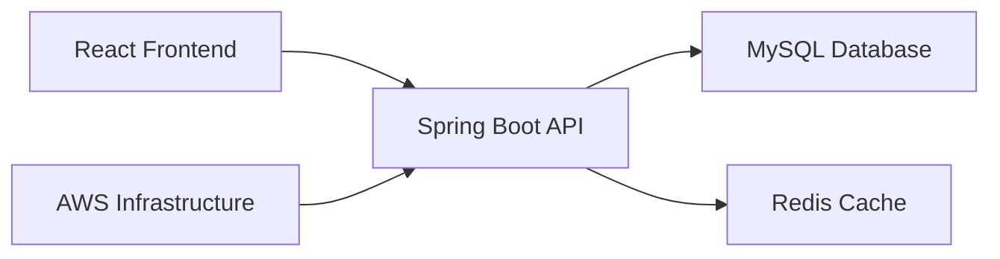

# Backend Developer

<div align="center">


</div>

## 👨‍💻 About

> **"배움에는 트레이드오프가 없다"**
>
> 시스템의 본질을 이해하고 확장 가능한 아키텍처를 설계하는 백엔드 개발자입니다.  
> 문제의 근본 원인을 파악하고 체계적인 해결책을 제시하는 것을 추구합니다.

<div align="center">

[](https://envyw.com)

</div>

---

## 🛠 Tech Stack

<table align="center">
<tr>
<td align="center" width="200px">

**Languages**


</td>
<td align="center" width="200px">

**Backend**


</td>
</tr>
<tr>
<td align="center">

**Database**


</td>
<td align="center">

**Infrastructure**


</td>
</tr>
</table>

---

## 🚀 Projects

<details open>
<summary><strong>🐱 Cat Framework</strong> - <em>TypeScript Web Framework</em></summary>

```typescript
import { Cat } from '@envyw/cat-framework';

const app = new Cat();
app.get('/api/users', (req, res) => {
    res.json({ users: [] });
});
```

**Tech Stack:** `TypeScript` `Node.js` `Express.js`

**Features:**

```bash
├── ⚡ Lightweight Architecture    # Minimal overhead, maximum performance
├── 📦 NPM Package Distribution   # Ready-to-use npm install
└── 🛠 Developer-Friendly API     # Intuitive and clean syntax
```

**Links:
** [](https://www.npmjs.com/package/@envyw/cat-framework) [](https://github.com/EnvyW6567/cat-framework)

</details>

<details open>
<summary><strong>🎲 Highroller Market</strong> - <em>Game Item Trading Platform</em></summary>

> **Dark and Darker 아이템 거래 플랫폼**  
> 🔍 Try searching for items in English!

**Tech Stack:** `Spring Boot` `React` `MySQL` `AWS`

**Architecture:**



**Development Status:**

```bash
├── 🚧 Continuous Development     # Post-deployment iterations
├── 🧪 TDD Implementation        # Test-driven development approach
├── 🔄 CI/CD Pipeline           # Automated deployment
└── 🔍 Real-time Search         # Optimized item search engine
```

**Links:
** [](https://www.highrollermarket.com) [](https://www.highrollermarket.com)

</details>

---

## 📊 GitHub Analytics

<div align="center">


</div>

<div align="center" style="display: flex; justify-content: space-around; align-items: center; margin: 20px 0;">


</div>

---

## 📫 Contact

<div align="center">

[](https://envyw.com)
[](https://github.com/EnvyW6567)
[](https://www.npmjs.com/package/@envyw/cat-framework)

</div>

---

<div align="center">

**Architecture is not about the tools you use, but about how you solve problems**


</div>